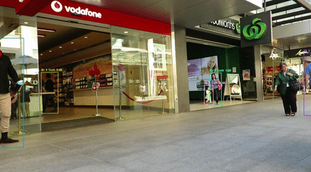
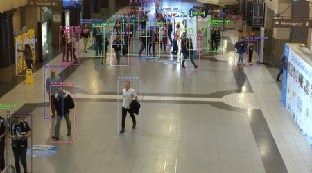

# AppMoTrack: Real-Time and Robust Multi-Object Tracking

<div align="center">

[](https://opensource.org/licenses/MIT)

</div>

**AppMoTrack** is a novel Tracking-by-Detection (TBD) framework designed for real-time, high-accuracy Multi-Object Tracking (MOT) on standard CPU hardware. It addresses common challenges like occlusion and complex object dynamics through a synergistic fusion of adaptive appearance modeling and motion prediction.

The official source code for our paper is available here:
**[https://github.com/MohammadJavadMohammadi/AppMoTrack](https://github.com/MohammadJavadMohammadi/AppMoTrack)**

---

## 📊 Qualitative Results

See AppMoTrack in action on the challenging MOT17 and MOT20 benchmarks. Notice the stable identity preservation even through heavy occlusion and crowded scenes—all running on a CPU.

| MOT17-09 Sequence | MOT20-02 Sequence |
| :---: | :---: |
|  |  |

---

## 🏛️ Core Architecture

AppMoTrack's strength lies in its modular and synergistic pipeline. An object detector first provides candidate bounding boxes. Our framework then executes a sophisticated association process to form robust tracks.

---

## ✨ Key Innovations

AppMoTrack introduces five key innovations to achieve a superior balance between tracking accuracy and computational speed:

1.  🧠 **Discriminative & Efficient Appearance Model**: We use a novel **IPCA-LDA pipeline** to extract compact yet highly discriminative appearance features. [cite_start]This ensures targets are clearly separable—even if they look similar—without requiring a GPU[cite: 3].
2.  🔗 **Hierarchical Association Strategy**: A multi-stage matching strategy robustly handles associations. [cite_start]It first uses a blend of appearance and motion (Buffered IoU), then leverages **HSV color histograms** to resolve ambiguities in difficult cases like occlusions[cite: 4].
3.  [cite_start]🎯 **Adaptive Matching Threshold**: A dynamic threshold, calculated on-the-fly using **k-means clustering** on the cost matrix, automatically adapts to different scenes and detection qualities, eliminating the need for manual tuning[cite: 5].
4.  [cite_start]🤔 **Uncertainty-Aware Cost Function**: The Kalman filter's **covariance matrix** is integrated directly into the association cost, giving priority to tracks with higher certainty and systematically improving reliability against prediction errors[cite: 6].
5.  [cite_start]⚡ **Adaptive Detection Usage (ADU)**: An intelligent frame-skipping module nearly **doubles the frame rate** by dynamically scheduling detector calls based on scene complexity, with minimal impact on accuracy[cite: 7].

---

## 🏆 Performance Highlights

AppMoTrack sets a new standard for CPU-based real-time MOT. [cite_start]All benchmarks were run on a standard **Intel(R) Xeon(R) CPU @ 2.20GHz** [cite: 350-351].

### **MOT17 Test Set**

| Tracker | **HOTA** $\uparrow$ | **MOTA** $\uparrow$ | **IDF1** $\uparrow$ | **FPS** $\uparrow$ |
| :--- | :---: | :---: | :---: | :---: |
| **AppMoTrack (Ours)** | **63.21** | 79.39 | 77.12 | **97.8** |
| OCSORT | 63.2 | 78.0 | 77.5 | 29.0 |
| ByteTrack | 63.1 | 80.3 | 77.3 | 29.6 |
| QuoVadis | 63.1 | 80.3 | 77.7 | 3.6 |

### **MOT20 Test Set**

| Tracker | **HOTA** $\uparrow$ | **MOTA** $\uparrow$ | **IDF1** $\uparrow$ | **FPS** $\uparrow$ |
| :--- | :---: | :---: | :---: | :---: |
| OCSORT | **62.4** | **75.7** | **76.3** | 18.7 |
| **AppMoTrack (Ours)** | 60.5 | 74.8 | 74.5 | **34.3** |
| QDTrack | 60.0 | 74.7 | 73.8 | 7.5 |

---

## 🚀 Getting Started

### 1. Installation

First, clone the repository and install the required dependencies.

```bash
git clone [https://github.com/MohammadJavadMohammadi/AppMoTrack.git](https://github.com/MohammadJavadMohammadi/AppMoTrack.git)
cd AppMoTrack
pip install -r requirements.txt
```

### 2. Download Pre-trained Models

AppMoTrack relies on pre-trained IPCA and LDA models. Download them from the links below and place them in the `tracker/` directory.

* **IPCA Model**: [Download ipca_model.joblib](https://drive.google.com/uc?export=download&id=1-BF2D4Anoym-dRYjbYqPc1w1maJp7aH_)
* **LDA Model**: [Download lda.pkl](https://drive.google.com/uc?export=download&id=1mLq2uegZ1YbqfwvHbKHtElCNkwLMcsKc)

### 3. Prepare Datasets and Detections

AppMoTrack is detector-agnostic and requires pre-computed detections.

* **Datasets**: Download the [MOT17](https://motchallenge.net/data/MOT17.zip) and [MOT20](https://motchallenge.net/data/MOT20.zip) datasets and structure them as expected.
* **Detections**: Our experiments used detections from YOLOX-X. The required format is `<frame_id>,<x>,<y>,<w>,<h>,<conf>`.

### 4. Run the Tracker

You can run AppMoTrack on a sequence using the `track.py` script. Please adjust the paths in the script to point to your data.

```bash
python track.py
```

The script will process the specified MOT sequence and save the tracking results in MOT format to the `output/` directory.


---

## 📄 License

This project is licensed under the MIT License. See the [LICENSE](LICENSE) file for details.
